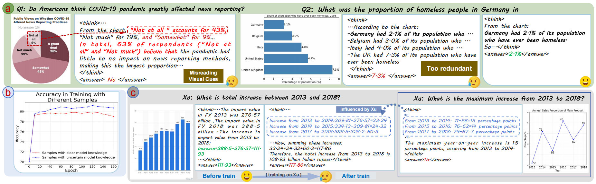
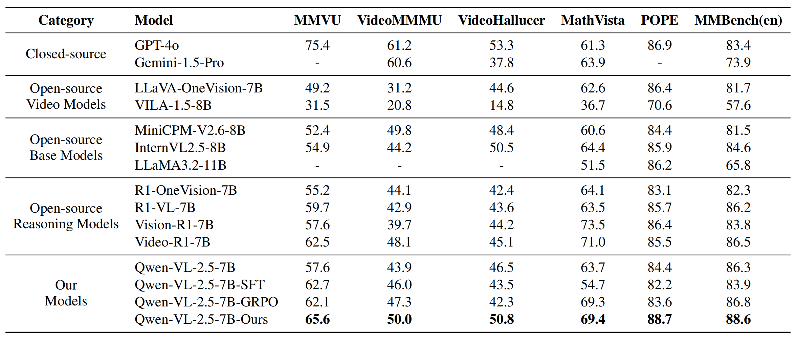

# Ground-What-You-See
Ground What You See: Hallucination-Resistant MLLMs via Caption Feedback, Diversity-Aware Sampling, and Conflict Regularization

## 🔥 News
- [2025/11/08] Our work is accepted by AAAI 2026.🎇🎇🎇

## 👀 Introduction
Three types of illusions in the field of multimodal large models:


## 🧠 Method


## 🏆 Performance


## 📐 Set up
### 0. Environment
```bash
git clone https://github.com/omniAI-Lab/Ground-What-You-See.git
cd Ground-What-You-See

# build environment
conda create -n video-ground python=3.11 
conda activate video-ground
pip install -r requirements.txt
```
### 1. Dataset
1. Cold-Start Dataset:
* [Llava-COT](https://huggingface.co/datasets/Xkev/LLaVA-CoT-100k)
* [Llava-COT-modify-json](https://www.ug.link/dx4600pro-gwj/filemgr/share-download/?id=5ae9374b8b3d4a6cba50a13ec42b0258)
2. RL Dataset:
* [Video-R1-Data](https://huggingface.co/datasets/Video-R1/Video-R1-data)
* [Train_RL_Medium_24K.json](https://ug.link/dx4600pro-gwj/filemgr/share-download/?id=8bd9deb8224044dfb33595c7ef8f21f0)

### 2. Train
#### 2.1 cold start  
`train/experiment/main/cold-start/run_sft.sh`
```bash
export DEBUG_MODE="true"
export LOG_PATH="/train/outputs/Main/ColdStart/debug_log.txt" # define your log path


CUDA_VISIBLE_DEVICES=0,1,2,3,4,5,6,7 torchrun --nproc_per_node="8" \
    --nnodes="1" \
    --node_rank="0" \
    --master_addr="127.0.0.1" \
    --master_port="12349" \
    train/experiment/main/cold-start/train/sft.py \
    --output_dir "train/outputs/Main/ColdStart/Qwen2.5-VL-7B-coldstart-sft" \
    --model_name_or_path "model/Qwen2.5-VL-7B-Instruct" \
    --dataset_name "Llava-COT-modify.json" \ # Replace with the address of the Llava COT modified json you downloaded
    --deepspeed train/local_scripts/zero2.json \
    --per_device_train_batch_size 1 \
    --gradient_accumulation_steps 1 \
    --learning_rate 1e-6 \
    --logging_steps 1 \
    --bf16 \
    --report_to wandb \
    --gradient_checkpointing true \
    --attn_implementation flash_attention_2 \
    --num_train_epochs 2 \
    --run_name Qwen2.5-VL-7B-coldstart-sft \
    --save_steps 1000 \
    --max_grad_norm 5 \
    --save_only_model false \
```
#### 2.2 RL
`train/experiment/main/RL-OURS/run_grpo.sh`
```bash
export DEBUG_MODE="true"
export LOG_PATH="/train/outputs/EXPERIENTS/Main/MediumSample/Qwen2.5-VL-7B-GRPO/debug_log.txt"


CUDA_VISIBLE_DEVICES=0,1,2,3,4,5,6,7 torchrun --nproc_per_node="8" \
    --nnodes="1" \
    --node_rank="0" \
    --master_addr="127.0.0.1" \
    --master_port="12365" \
    /train/experiment/EXPERIMENTS/Main/RL/grpo/grpo.py \
    --output_dir "/train/outputs/EXPERIENTS/Main/MediumSample/Qwen2.5-VL-7B-GRPO" \
    --model_name_or_path '/train/outputs/Main/ColdStart/Qwen2.5-VL-7B-coldstart-sft' \ # The address of the model trained during the cold start phase
    --dataset_name "/data/train_data/OmniVisionData/Train_RL_Medium_24K.json" \ # Download JSON data address
    --deepspeed /train/local_scripts/zero3.json \
    --max_prompt_length 16384 \
    --max_completion_length 768 \
    --per_device_train_batch_size 1 \
    --gradient_accumulation_steps 1 \
    --learning_rate 1e-6 \
    --lr_scheduler_type "cosine" \
    --weight_decay 0.01 \
    --bf16 \
    --logging_steps 1 \
    --gradient_checkpointing true \
    --attn_implementation flash_attention_2 \
    --max_pixels 401408 \
    --num_train_epochs 1 \
    --run_name OmniVisionR1-MAIN-Finally-Medium-GRPO-Training \
    --save_steps 100 \
    --beta 0.04 \
    --max_grad_norm 5 \
    --save_only_model false \
    --num_generations 8
```

